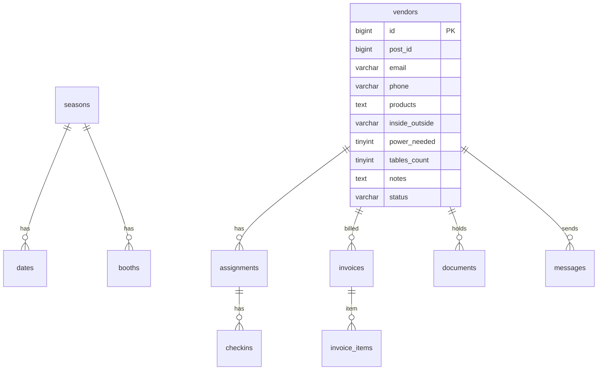

# Architecture (Working)

```mermaid
erDiagram
  vendors ||--o{ assignments : has
  seasons ||--o{ dates : has
  seasons ||--o{ booths : has
  assignments ||--o{ checkins : has
  vendors ||--o{ invoices : billed
  invoices ||--o{ invoice_items : item
  vendors ||--o{ documents : holds
  vendors ||--o{ messages : sends

  vendors {
    bigint id PK
    bigint post_id
    varchar email
    varchar phone
    text products
    varchar inside_outside
    tinyint power_needed
    tinyint tables_count
    text notes
    varchar status
  }
```
See `specs/Data-Model.sql` for DDL.
